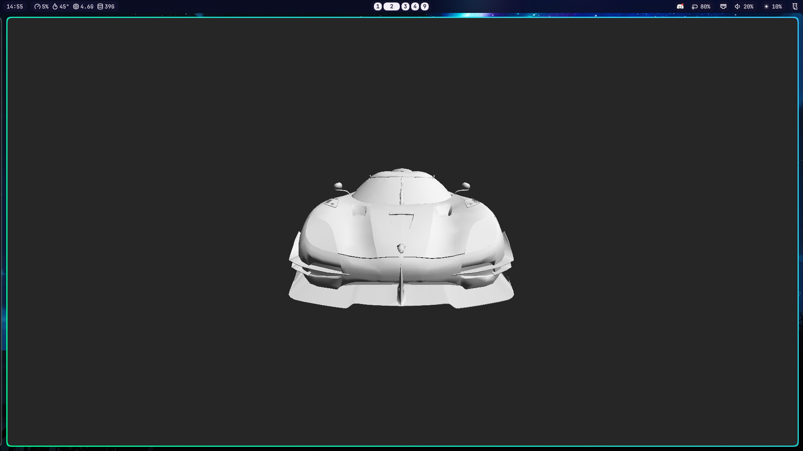
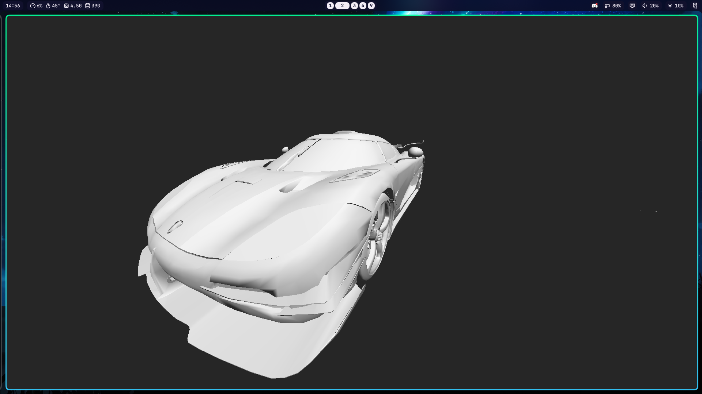
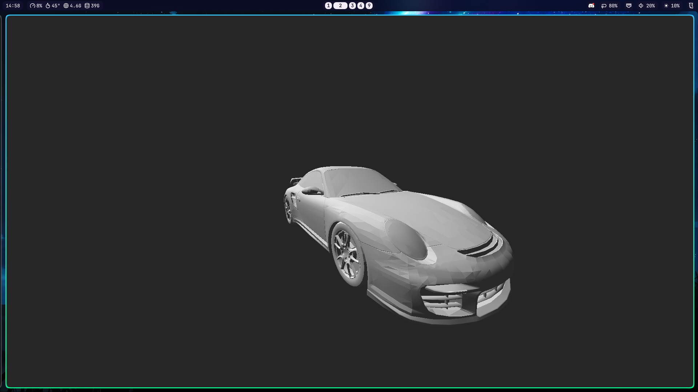
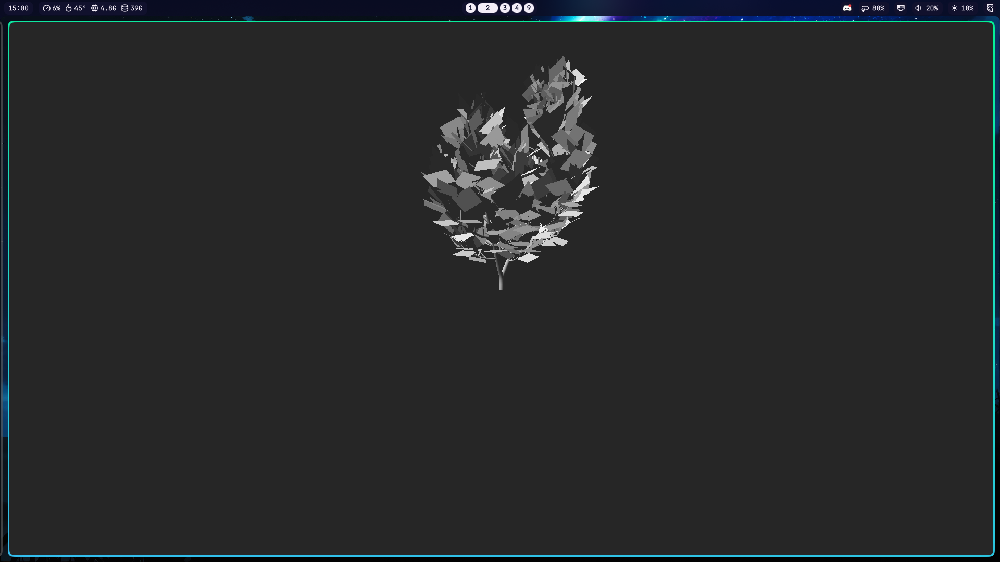

# Sokol 3D Model Viewer

A 3D model viewer that can load an object file `.obj` and display them.

This would not have been possible **without** the tutorial that [Coding with Sphere](https://www.youtube.com/@codingwithsphere) provided on [YouTube](https://youtube.com).

> [!NOTE]
> Original work by 'Coding with Sphere' and resources can be found at:
>
> - YouTube Video Tutorial ( _in order_ ):
>   - <https://www.youtube.com/watch?v=GCnipL4T0Ho>
>   - <https://www.youtube.com/watch?v=FFpSEo3geL4>
>   - <https://www.youtube.com/watch?v=e23SJ-6zUrk>
> - GitHub Repository Link: <https://github.com/vimichael/eidos-c>
> - Sokol GitHub Repository Link: <https://github.com/floooh/sokol/tree/master>
> - CGLM GitHub Repository Link: <https://github.com/recp/cglm>
> - Fast Object GitHub Repository Link: <https://github.com/thisistherk/fast_obj>
> - Model Library: <https://free3d.com/3d-models/obj?dd_referrer=https%3A%2F%2Fwww.google.com%2F>
>   - Koenigsegg Agera Model: <https://free3d.com/3d-model/koenigsegg-agera-72095.html>
>   - Porsche 911 GT2 Model: <https://free3d.com/3d-model/porsche-911-gt-43465.html>

## Screenshots









---

# Backstory

So, I am **not** really into game development and 3D "_things_".

One day I was browsing on the YouTube and came across Coding with Sphere's channel and it was really fun to see how he was using Windows like a Linux user by installing things like Window Managers and similar stuff.

> Ahh, back when he was still on Windows but now he does use "Arch BTW"!

Then, trying to learn more about him; I see that he is mainly a game development YouTube channel and I don't really understand what he does but he is really cool.

Because of how the unknown YouTube algorithms works... I started getting more videos recommended made by him and this 3 videos kept popping in my feed for years on end and they were about a tutorial whereby he is going to use Sokol to teach us how to make a _command line_ model viewer.

From what I remember he was saying in the first video is that he needed one to quickly view models that he was going to use when he makes his own games.

## Watching The Tutorials

I know **nothing** about [Game Development](https://en.wikipedia.org/wiki/Video_game_development) or [Graphics Programming](https://en.wikipedia.org/wiki/Computer_graphics) as I more of a, what I like to call myself, a **utility person**. Where I try to learn things to program stuff that help myself and my friends.

I was really cool to learn to follow the tutorials and actually learn something that I _think_ that I am never going to touch again.

> A breath of fresh air you might say!

By the 3rd video I was able to learn a lot of things and takes lots of notes so that when I will eventually forget about stuff. I will be able to refer back to them.

> [!NOTE]
> My learning notes are found inside the ['learning'](https://github.com/Sunhaloo/sokol-3D-model-viewer/tree/main/learning) folder found inside this very repository itself.

## The Problem

As of the 19th of July 2026, he has yet to complete the project.

> I think he **abandoned** the project and also on _his_ repository the last commit was 10 months ago!

Given the amount of fun that I was having when building it... I really wanted to complete the _whole_ project and be to also be able to show people what "_I_" have made ( _again would not be possible without the YouTube videos by Coding with Sphere_ ).

But I was left a bit on my own here and I really wanted to make this work...

## Using Large Language Models

Similar to how my _semi-failed_ [mouse-c-py](https://github.com/Sunhaloo/mouse-c-py) project... I was originally just using Claude as a search engine to learn more about graphics programming terms and concepts in more detail ( _as the coding part was already been shown in the videos_ ).

Nevertheless, at the end of the third episode... I asked Claude to also help me with the implementation so that I am able to continue and complete the project.

Now, if you know me... You know I like to type a lot with my _split, 40%, mechanical_ [Corne Keyboard](https://github.com/foostan/crkbd)... This is why I am still in the stone age and write each line of code by myself ( _when I completely know what I am doing_ ).

Given that this is based on C; I would definitely need some help in order to complete it.

Long story short, Claude help me a bunch with _infrastructural_ decision like building my own object [parser](https://en.wikipedia.org/wiki/Parsing) versus using a pre-existing one for simplicity sake.

> Again, most if not all of my learning are found inside the `learning/Making A 3D Model Viewer With Sokol.md` file.

### "Improving The Project"

Given that he as already switch fully to Linux at that point. He made the project to work on Linux ( _I don't know if he planned to make it work on other operating systems_ ).

Reading the `sokol_app.h` file I found this:

```C
/*
    Link with the following system libraries:

    - on macOS:
        - all backends: AppKit, QuartzCore
        - with SOKOL_METAL: Metal
        - with SOKOL_GLCORE: OpenGL
        - with SOKOL_WGPU: a WebGPU implementation library (tested with webgpu_dawn)
    - on iOS:
        - all backends: Foundation, UIKit, QuartzCore
        - with SOKOL_METAL: Metal
        - with SOKOL_GLES3: OpenGLES, GLKit
    - on Linux:
        - all backends: X11, Xi, Xcursor, dl, pthread, m
        - with SOKOL_GLCORE: GL
        - with SOKOL_GLES3: GLESv2
        - with SOKOL_WGPU: a WebGPU implementation library (tested with webgpu_dawn)
        - with SOKOL_VULKAN: vulkan
        - with EGL: EGL
    - on Android: GLESv3, EGL, log, android
    - on Windows:
        - with MSVC or Clang: library dependencies are defined via `#pragma comment`
        - with SOKOL_WGPU: a WebGPU implementation library (tested with webgpu_dawn)
        - with SOKOL_VULKAN:
            - install the Vulkan SDK
            - set a header search path to $VULKAN_SDK/Include
            - set a library search path to $VULKAN_SDK/Lib
            - link with vulkan-1.lib
        - with MINGW/MSYS2 gcc:
            - compile with '-mwin32' so that _WIN32 is defined
            - link with the following libs: -lkernel32 -luser32 -lshell32
            - additionally with the GL backend: -lgdi32
            - additionally with the D3D11 backend: -ld3d11 -ldxgi
*/
```

I was saying to myself that I could "_improve_" the project to add cross-platform compatibility between Linux - Unix systems and Windows systems.

Then I realised that we simply needed to modify our `Makefile` so that its able to compile on Windows... Given that Sokol is such a great project; there is **no** need to modify our actual code for it to work on different platforms!

We actually just needed to modify our `Makefile` to add this:

```bash
# check if we are on a Windows / Linux system
ifeq ($(OS),Windows_NT)
 # Windows system
  OUTPUT = build/program.exe
  LIBS = -lkernel32 -luser32 -lshell32 -lgdi32
else
 # Linux system
  OUTPUT = build/program
  LIBS = -lX11 -lXi -lXcursor -lGL -lasound -ldl -lm -pthread
endif
```

# Usage

## Windows Systems

> I know most of the people in my country uses Windows. So _unfortunately_, I am going to be writing this part first.

- Head to the [releases](https://github.com/Sunhaloo/sokol-3D-model-viewer/releases) and download the `sokol-3d-model-viewer-windows.exe` executable file
- Go ahead and add your own model / object file or download the included models / object file over at the release page if you don't have any
- To use it simply make sure that **both** the executable and the model file that you want to display is inside the **same directory / folder**
- Simply run with the following command: `./sokol-3d-model-viewer-windows.exe <object_file_name>.obj`
  - For example: `./sokol-3d-model-viewer-windows.exe porsche_911_GT2.obj`

## Linux Systems

- Head to the [releases](https://github.com/Sunhaloo/sokol-3D-model-viewer/releases) and download the `sokol-3d-model-viewer-linux` binary file
- Go ahead and add your own model / object file or download the included models / object file over at the release page if you don't have any
- To use it simply make sure that **both** the binary and the model file that you want to display is inside the **same directory / folder**
- Simply run with the following commands:
  - Change permission of binary: `chmod +x sokol-3d-model-viewer-linux`
  - Run with `./sokol-3d-model-viewer-linux <object_file_name>.obj`
    - For example: `./sokol-3d-model-viewer-linux porsche_911_GT2.obj`

> [!WARNING]
> I don't know why this happen but you are going to first have to `chmod +x` the `sokol-3d-model-viewer-linux` binary to be able to use it else you are going to have a permission error.
>
> Maybe is because of the way that I am building it on the virtual `ubuntu-latest` runner but then again, I don't know why it would do that.
>
> Asking Claude about it tells me that is the reason as to why people `tar`s it so that it maintains all the permissions but I don't want to do that as I am just _shipping_ a "_single_" file.
>
> Therefore, the simplest way right now is for me to write in here that you have to `chmod +x` the binary **before** using it.

## Mouse Events

Here are the followings _keybindings_ to help you show move the model and "_navigate_" around.

| Mouse Events                  | Operation              |
| ----------------------------- | ---------------------- |
| Left Click + Mouse Move Up    | View model's underside |
| Left Click + Mouse Move Down  | View models top        |
| Left Click + Mouse Move Right | View models left       |
| Left Click + Mouse Move Left  | View models right      |
| Right Click                   | Reset Camera Position  |
| Scroll Up                     | Zoom In                |
| Scroll Down                   | Zoom Out               |

> I think you do get the point that I am trying to convey

---

## Somethings To Consider

1. It does **not** display any _colour_ and everything is grey ( _see `assets/shader/model.glsl` file_ )
2. Some object is **not** correctly displayed due to complex geometry or missing _normals_ ( _I don't plan to solve the issue also_ )

---

# Development

> IDK... If you want to learn more from this _shitty_ project or make it better!

Before we get to the setup for each operating system below... I need you tell you how to clone this repository.

Why? Because I learned how to use Git Submodules and the `clone` command is a bit different than just a simple `git clone <url>` command.

## Cloning Project

To clone the project and also populate the other submodules found in the `dependencies` folder, simply run the following command like so:

```bash
# clone using 'https'
git clone --recurse-submodules https://github.com/Sunhaloo/sokol-3D-model-viewer.git

# clone using 'ssh'
git clone --recurse-submodules git@github.com:Sunhaloo/sokol-3D-model-viewer.git
```

> [!WARNING]
> If you have already clone using the simple `git clone` command... You should see that the folders inside the `dependencies` directory have nothing in them.
>
> Therefore, to fix / populate those submodules... You are going to have to run this additional command in order to properly clone the entire repository / project.
>
> ```bash
> # populate the actual git submodules found inside the `dependencies` directory
> git submodule update --init
> ```

## Linux Development

> [!IMPORTANT]
> The whole development of this project was made while I was on Linux and **not** Windows.
>
> Therefore, things like `sokol-shdc` which you are going to have to download to be able to convert the `model.glsl` file to the `model_shader.h` file ( _see `Makefile`_ ).
>
> I am going to provide the correct link for both Linux and Windows system as if you are purely on Windows... You will be able to find the correct resource to be able to work with the project.
>
> > You are going to have to modify the `Makefile` ( _I think_ ) to make it work on Windows as its called `sokol-shdc.exe` instead of `sokol-shdc`.

### Requirements

- Linux Machine ( _I use Arch BTW_ )
- Compilation and Running: `clang` and `make`
- `sokol-shdc` Linux Binary: <https://github.com/floooh/sokol-tools-bin/tree/master/bin/linux>

> [!NOTE]
> The reason that I used `clang` instead of my usual `gcc` is because I went and research ( _its in my notes_ ) about both of them.
>
> I have been using `gcc` all my life and I just wanted to "_taste_" `clang`...

## Windows Development

- Windows Machine ( _preferably Windows 11_ )
- [MSYS2](https://www.msys2.org/):
  - [`clang`](https://packages.msys2.org/packages/mingw-w64-ucrt-x86_64-clang)
  - [`mingw-w64-make`](https://packages.msys2.org/base/mingw-w64-make) or simply [`make`](https://packages.msys2.org/base/make)
- `sokol-shdc` Windows Executable: <https://github.com/floooh/sokol-tools-bin/tree/master/bin/win32>

> [!WARNING]
> Refer to the `shader` target in our `Makefile` to learn more about how to convert `.glsl` files into **header files**.

## Building and Running

Now, as you know I come from the world of **interpreted language** / Python. This means there we only have to do something like `python main.py` and you are able to _see_ your program or your little errors that you yet to solve!

Hence, given that we all know that C is a **compiled langauge**... Meaning that we are have to do another step to actual run the thing. I decided that I had enough of that and decided to automate the process using `Makefile` ( _like I am doing here_ ).

Yes, that is how I started to use `Makefile` just to not type `./program` or something like that. Because I kept staring at my screen when I finished compiling when I first started to write C.

> So old habits die hard I guess! [Anyways](https://www.youtube.com/watch?v=9S8eNZ4fw5I&t=4s)...

- To **compile** and **run** the program _at the same time_:

```bash
# simply run the make command and it should default to the koenigsegg model
make
```

- If you want to choose another model and **compile** and **run** the program:

```bash
# override the model by changing the `MODEL` "variable"
make MODEL=/path/to/any/file.obj
```

- To only **compile** to source code:

```bash
# only compile the source code
make compile
```

- To clean any residual `build/program` or `build/program.exe` files:

```bash
# clean the build directory
make clean
```

---

# Socials

- **GitHub**: <https://www.github.com/Sunhaloo>
- **Instagram**: <https://www.instagram.com/s.sunhaloo>
- **YouTube**: <https://www.youtube.com/@s.sunhaloo>

---

S.Sunhaloo
Thank You!
